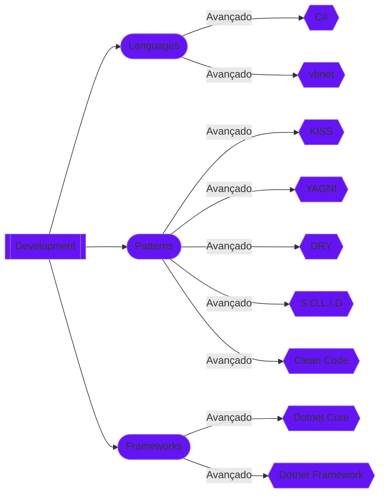
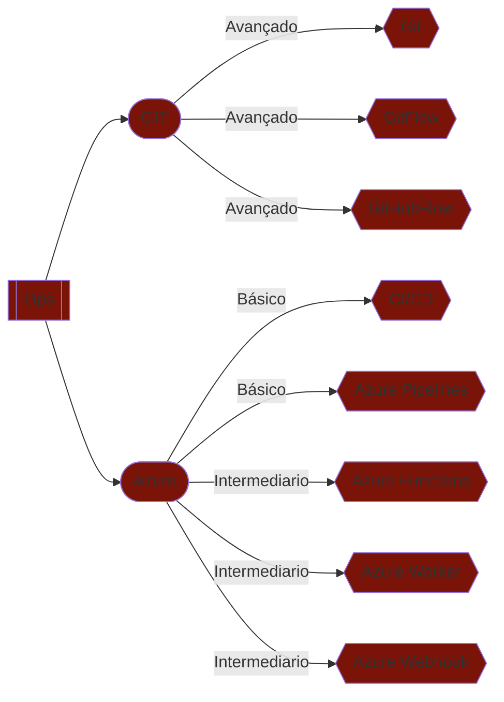
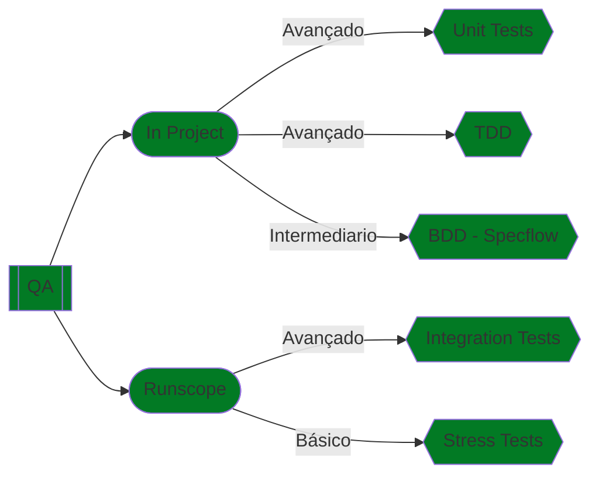

# flavio-canedo

```mermaid
graph LR
    D[[Development]]:::code
        D --> DL([Languages]):::code
            DL --> |Avançado| DL1{{C#}}:::code
            DL --> |Avançado| DL2{{vbnet}}:::code
        D --> DP([Patterns]):::code
            DP --> |Avançado| DP1{{KISS}}:::code
            DP --> |Avançado| DP2{{YAGNI}}:::code
            DP --> |Avançado| DP3{{DRY}}:::code
            DP --> |Avançado| DP4{{S.O.L.I.D}}:::code
            DP --> |Avançado| DP5{{Clean Code}}:::code
        D --> DF([Frameworks]):::code
            DF --> |Avançado| DF1{{Dotnet Core}}:::code
            DF --> |Avançado| DF2{{Dotnet Framework}}:::code
    classDef code fill:#6514F5
```

```mermaid
graph LR
    O[[Ops]]:::ops        
        O --> OF([GIT]):::ops
            OF --> |Avançado| OF1{{Git}}:::ops
            OF --> |Avançado| OF2{{GitFlow}}:::ops
            OF --> |Avançado| OF3{{GitHubFlow}}:::ops
        O --> OA([Azure]):::ops
            OA --> |Básico| OA1{{CI/CD}}:::ops
            OA --> |Básico| OA2{{Azure Pipelines}}:::ops
            OA --> |Intermediario| OA3{{Azure Functions}}:::ops
            OA --> |Intermediario| OA4{{Azure Worker}}:::ops
            OA --> |Intermediario| OA5{{Azure Webhook}}:::ops
    classDef ops fill:#7A1409
```

```mermaid
graph LR
    Q[[QA]]:::qa
        Q --> QP([In Project]):::qa
            QP --> |Avançado| QP1{{Unit Tests}}:::qa
            QP --> |Avançado| QP2{{TDD}}:::qa
            QP --> |Intermediario| QP3{{BDD - Specflow}}:::qa
        Q --> QR([Runscope]):::qa            
            QR --> |Avançado| QR1{{Integration Tests}}:::qa
            QR --> |Básico| QR2{{Stress Tests}}:::qa
    classDef qa fill:#027A24
```

CLICK ME

#### We can hide anything, even code!

